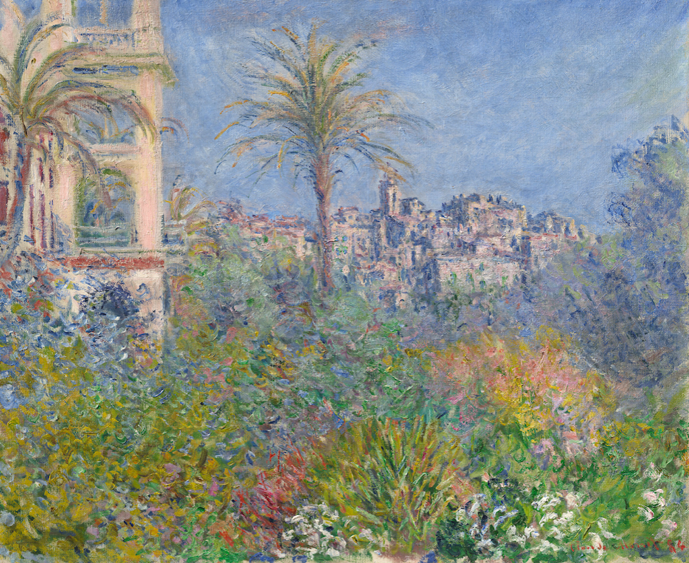

Claude Monet, Villas at Bordighera (1884)
# Education 
- B.S. Science, Computer Science, University of Toronto (2022/09 - Current)

# Research Interests
- Explainable AI (XAI)
- LLM Intepretability & Alignment
- Neural-Symbolic System
- Knowledge Representation

# Research Experience
*Collaborative Researcher  @PRADA Lab, KAUST (2024/06 - Present)* 

*Research Assistant @SocialAI Lab, University of Toronto (2024/05 - Present)* 
advisor: William Cunningham

*Research Assistant  @Department of Computer Science, University of Toronto (2023/12 - Present)* 
advisor: Xujie Si

*Research Assistant  @CoNSens Lab, University of Toronto (2024/5 - 2024/9 Expected)* 
advisor: Matthias Niemeier

# Work Experience
*AI/NLP Analyst @ Urban Data Research Centre, University of Toronto (2024/05 - Present)*

*Data Analyst Intern @ University of Toronto Scarborough (2024/01 - 2024/05)*

# Projects
## Minagen: A Minimal Testing Ground for Building Cognitive Architectures for Generative Agents
[{Code}]()
[{Paper}]()

This project is dedicated to the development and testing of cognitive architectures designed for generative AI agents. Our primary goal is to provide a minimalistic, yet powerful platform for researchers and developers to explore ideas and test hypotheses in the realm of cognitive modeling and AI.

## Career Navigator: LLM & Knowledge Graph-Based Job Recommender Engine

[[Code]](https://github.com/ShenzheZhu/Career_Navigator_UTSC_AScoop)

Career Navigator is an innovative job recommendation service based on LLM and Knowledge Graph. It addresses challenges students face on the CSM platform, improving job search efficiency. By leveraging advanced knowledge graph technology and algorithms, the system analyzes student resumes, matches them with job data, and recommends the best-fit positions.

# Selected Papers
## Exploring knowledge graph-based neural-symbolic system from application perspective
Author: Shenzhe Zhu, Shengxiang Sun

[[Paper]](https://arxiv.org/pdf/2405.03524)

This paper explores recent advancements in neural-symbolic integration based on KG, examining how it supports integration in three categories: enhancing the reasoning and interpretability of neural networks with symbolic knowledge (Symbol for Neural), refining the completeness and accuracy of symbolic systems via neural network methodologies (Neural for Symbol), and facilitating their combined application in Hybrid Neural-Symbolic Integration. It highlights current trends and proposes future research directions in Neural-Symbolic AI.

# Publications & Pre-Prints
1. [Zhu S. Exploring knowledge graph-based neural-symbolic system from application perspective[J]. arXiv preprint arXiv:2405.03524, 2024.](https://arxiv.org/pdf/2405.03524)
2. [Sun, S., & Zhu, S. (2024). Searching Realistic-Looking Adversarial Objects For Autonomous Driving Systems. arXiv preprint arXiv:2405.11629.](https://arxiv.org/pdf/2405.11629)

   
- [CV](/asset/files/Work_CV.pdf)
- [Google Scholar](https://scholar.google.com/citations?user=WBZCniUAAAAJ&hl=zh-CN)
- [Linkedin](https://www.linkedin.com/in/shenzhezhu0531/)
- [Email](mailto:cho.zhu@mail.utoronto.ca)
- [Github](https://github.com/ShenzheZhu)

